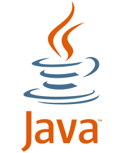

# OO Design Final Project
**Holt Skinner 🤓 & Kyle Whitney ♿️**

*CS 4330 Spring 2017*

>  An analysis of Java and Swift based on Object-Oriented Design Principles.

Java


Swift


> Computer Science is about as close to magic you can get, if you're smart enough.  
> ~ Dale Musser

## Language Purpose & Origins 📚
🤓

### Java

#### Early History
The Java programming language (not to be confused with *JavaScript*) was first released in 1995 by Sun Microsystems. The project was started in 1990 as a response to C and C++. Programmers were becoming frustrated by the tedious tasks required by the language, such as memory management and incompatability between operating systems. The goal was to create a virtual machine and language that was similar to C, but much simpler to program in. Jasmes Gosling was chosen as the lead architect for the team of only 13 people, soon known as *The Green Team.* [^1] The name *Java* was chosen after the Indonesian island Java, and the slang term for coffee. ☕️ [^2]

#### Philosophy
There were 5 primary goals in mind when creating Java.
1. It should use the object-oriented programming methodology.
2. It should allow the same program to be executed on multiple operating systems.
3. It should contain built-in support for using computer networks.
4. It should be designed to execute code from remote sources securely.
5. It should be easy to use by selecting what was considered the good parts of other object-oriented languages.
   [^3]

> A Simple "Hello World" program in Java.

```java
System.out.println("Hello World!");
```

### Swift

#### Early History
The Swift programming language (not to be confused with [*Taylor Swift*](https://en.wikipedia.org/wiki/Taylor_Swift)) began development in July 2010 under the direction of Chris Lattner at Apple. Swift was designed as a replacement for Objective-C, to be used as the primary language for iOS and macOS development. Swift took language ideas "from Objective-C, Rust, Haskell, Ruby, Python, C#, CLU, and far too many others to list." [^4] Although not officially stated, it is quite apparent that many ideas were borrowed from Java as well. Swift was unveiled by Craig Federighi at WWDC 2014; it was described as "Objective-C without the baggage of C."

[](https://youtu.be/MO7Ta0DvEWA)

#### Philosophy
Similar to Java, Swift's primarily goal was to greatly simplify the software engineering process. Some of the minor adjustments include:
- No semicolons required `;`
- No header files to manage
- Type inference
- Functions are first class citizens.
- Null pointer exceptions are not possible via the use of optionals (see below)
- C-style enumeration `for (int i = 0; i < size; i++)` is not allowed. [^5]

> A Simple "Hello World" program in Swift.  
> Notice how this program is 14 characters fewer than the Java example.

```swift
print("Hello World!")
```

## Unique Features 🦄
🤓

### Java

Many of the "unique" features of Java have been encorporated into other languages as the field has progressed. The initial selling point was that Java code is platform independant due to the existance of the Java Virtual Machine (JVM). Code could be written and compiled for the JVM, and the compiled byte codes could be used on any machine with the JVM installed. In addition, other languages such as Clojure, Groovy ☮️ and Scala were written to run on the JVM.

### Swift

The most notable unique feature of Swift is the notion of an "Optional" denoted by `?` An optional prevents the common programming error of a "Null Pointer Exception" by "wrapping up" values that can potentially hold a nil reference. These optional values must be "unwrapped" using the `if let` construct. This is conceptually similar to the idea of dereferencing a pointer in `C/C++`.

> An example of Optionals [^6]

```swift
// A Swift Dictionary
let ages = ["Mohsen": 17, "Amy": 40, "Graham": 5]

// Defining a constant, possibleAge, of type Int Optional
let possibleAge: Int? = ages["Daryl"]

// Unwrapping the Optional
if let age = possibleAge {
    // This line will only run if age != nil
    print("An age of \(age) was found.")
}

```

> Another Example of Optionals [^7]

```swift
var optionalString: String? = "Hello"

print(optionalString == nil)
 
var optionalName: String? = "John Appleseed"

var greeting = "Hello!"

if let name = optionalName {
    greeting = "Hello, \(name)"
}
```

Many of the other features of Swift are modeled after popular programming languages. [10 features Apple 'stole' for Swift](http://www.infoworld.com/article/2606431/application-development/155797-10-prominent-features-stolen-by-Apple-s-Swift-and-where-they-came-fro.html)

## Namespaces ☂️
♿️

### Java
In Java Namespace's are called packages. 📦  Packages serve to group related classes and define a namespace for the classes they contain. [^16] A class in a package can refer to any other class in the package by the simple name of the class. Packages are implemented by the keyword import.
```java
import java.io.File; // Imports the File class within the java.io package
```
```java
import java.io.*; // Imports all the classes within the java.io package
```

### Swift
In Swift Namespace's are called Modules. A module is a single unit of code distribution — a framework or application that is built and shipped as a single unit and that can be imported by another module.[^17] Just like Java, Swift used the keyword import to implement a Module.

```swift
import UIKit
```
## Types 🕶
♿️

### Java
Java supports reference types and 8 primitive types. int, double, float, long, short, boolean, byte, and char.[^18] Java has the ability to pass by value and pass by reference. Java also has the ability to create new object types.  
```java
//the 8 primitive types 
int i = 2147483647;
double d = 1.7976931348623157E308;
float f = 3.4028235E38;
long l = 9,223,372,036,854,775,807;
short s = 32,767;
boolean b = false;
byte bte = 127;
char c = 'c';

//Some reference types
String s = "Dale";
Scanner scan = new Scanner();
Random rnd = new Random();
Integer num = new Integer();

//pass-by-value
int x = 42;
int y = x;

//pass-by-reference
Dog myDog = new Dog("Max"); // 🐕 😃
Dog yourDog = myDog; // 🐕 😢
```

### Swift
Swift offers the programmer a rich assortment of built-in as well as user-defined data types. Some of them are Int8, UInt8, Int32, UInt32, Int64, UInt64, Float, Double, Bool, String, Character, Optional.[^19] Int's and UInt's can be repesented in 8 Bit, 16 Bit, 32 Bit, and 64 Bit forms. UInt's are unsigned integers while Int's are signed integers. In Swift you can pass-by-value and pass-by-reference. Swift also has the ability to create new value types.
Swift also has a couple of unique type features Type Inference, Type Safety and Type Aliases. First, Type Inference which enables the compiler to deduct the type of a particular expression automatically when it compiles your code. Second, Type Saftey performs type-checks when compiling your code and flags any mismatched types as errors. Last, Type Aliases is where you can create a new name for an existing type.

```swift
//Type Inference
let 😃 = "Smiley face"
let num = 42

 //Type aliases
typealias AudioSample = UInt16

var maxAmplitudeFound = AudioSample.min

//Booleans

let orangesAreOrange = true // 🍊 = 🍊
let orangeAreApples = false // 🍊 ≠ 🍎
 
 //Optionals

 var myDog: Dog? = Dog()

 //unwrapping optional

 if let yourDog = myDog {
     //this line will only print if myDog doesn't = nil
     print("You stole my dog!") // 😡 🐕
 }

  // Type Saftey
  var myDog = Dog()
  myDog = "cat" //It will fail at run time 😿
```
## Classes 🎓
♿️
 ### Java
 In Java a class can be defined as a template/blueprint that describes the behavior/state that the object of its type support.[^20] When creating new object the keyword **new** is used followed by a call to a constructor. This call initializes the new object. Java has a garbage collecter and you cannot predict when (or even if) an object will be destroyed. Hence there is no direct equivalent of a destructor.[^21]
 ``` java
 // declaring a new object
 Turtle tt = new Turtle(); // 🐢

 // At some point Garbage collection will happen 🤔
 tt = null;
```

 ### Swift
 Classes and structures are general-purpose, flexible constructs that become the building blocks of your program’s code. You define properties and methods to add functionality to your classes and structures by using exactly the same syntax as for constants, variables, and functions. Unlike Java, Swift uses the keyword ``init`` to initalize a new object. In Swift a deinitializer is called immediately before a class instance is deallocated. You write deinitializers with the ``deinit`` keyword, similar to how initializers are written with the init keyword. Deinitializers are only available on class types. [^22]
 
 ```swift

//Initialization
struct Fahrenheit {
    var temperature: Double
    init() {
        temperature = 32.0
    }
}

var f = Fahrenheit()
print("The default temperature is \(f.temperature)° Fahrenheit")
// Prints "The default temperature is 32.0° Fahrenheit"

//Deinitialization
deinit {
    Fahrenheit.temperature
}
```

## Instance Reference 🍰  
♿️

### Java
Within an instance method or a constructor, `this` is a reference to the current object — the object whose method or constructor is being called. You can refer to any member of the current object from within an instance method or a constructor by using `this`. [^23]

```java
//use of "this" keyword in the constructor
    public Point(int x, int y) {
        this.x = x;
        this.y = y;
    }
```

### Swift
Every instance of a type has an implicit property called `self`, which is exactly equivalent to the instance itself. You use the `self` property to refer to the current instance within its own instance methods. [^24]

``` swift
func increment() {
    self.count += 1
}
```

## Properties 🍩  
♿️

### Java
In Java setter are used to set a new field and a getter is used to get a private field. Unfortunately in java setters and getters have to written by the programmer but most IDE's can auto generate them. Java required the use of backing variables for setters and getters.

```java
private String name;

public void setName(String name) {
    this.name = name;
}
public String getName() {
    return name;
}
```

### Swift
Properties in Swift have associate values with a particular class, structure, or enumeration. Stored properties store constant and variable values as part of an instance, whereas computed properties calculate (rather than store) a value. Computed properties are provided by classes, structures, and enumerations. Stored properties are provided only by classes and structures.[^29]

1. Stored Properties 
In its simplest form, a stored property is a constant or variable that is stored as part of an instance of a particular class or structure.

```swift
struct FixedLengthRange {
    var firstValue: Int
    let length: Int
}
var rangeOfThreeItems = FixedLengthRange(firstValue: 0, length: 3)
// the range represents integer values 0, 1, and 2
rangeOfThreeItems.firstValue = 6
// the range now represents integer values 6, 7, and 8
```

2. Lazy Stored Properties
A lazy stored property is a property whose initial value is not calculated until the first time it is used. You indicate a lazy stored property by writing the lazy modifier before its declaration.

```swift
class FinalProject {
    print("Final Project Done!!)
}

class CS4330Student {
    lazy var doFinalProject = FinalProject()
}

let finalGrade = CS4330Student()
```

3. Computed Properties
In addition to stored properties, classes, structures, and enumerations can define computed properties, which do not actually store a value. Instead, they provide a getter and an optional setter to retrieve and set other properties and values indirectly.

```swift
struct Point {
    var x = 0.0, y = 0.0
}

struct Size {
    var width = 0.0, height = 0.0
}

struct Rect {
    var origin = Point()
    var size = Size()
    var center: Point {
        get {
            let centerX = origin.x + (size.width / 2)
            let centerY = origin.y + (size.height / 2)
            return Point(x: centerX, y: centerY)
        }
        set(newCenter) {
            origin.x = newCenter.x - (size.width / 2)
            origin.y = newCenter.y - (size.height / 2)
        }
    }
}

var square = Rect(origin: Point(x: 0.0, y: 0.0),
                  size: Size(width: 10.0, height: 10.0))

let initialSquareCenter = square.center
square.center = Point(x: 15.0, y: 15.0)

print("square.origin is now at (\(square.origin.x), \(square.origin.y))")
// Prints "square.origin is now at (10.0, 10.0)"
```

##  Interfaces / Protocols 📲  
♿️

### Java
An interface is a reference type in Java. It is similar to class. It is a collection of abstract methods. A class implements an interface, thereby inheriting the abstract methods of the interface. Along with abstract methods, an interface may also contain constants, default methods, static methods, and nested types. Method bodies exist only for default methods and static methods. [^25]

```java 
 public class Turtle implements Animal {
     //Animals methods and unique Turtle methods
 }
 ```

 ### Swift
 A protocol defines a blueprint of methods, properties, and other requirements that suit a particular task or piece of functionality. The protocol can then be adopted by a class, structure, or enumeration to provide an actual implementation of those requirements. Any type that satisfies the requirements of a protocol is said to conform to that protocol. [^26]

 ``` swift
 class SomeClass: SomeSuperclass, FirstProtocol, AnotherProtocol {
    // class definition goes here
}
```

 ##  Inheritance / Extension 👨‍👩‍👧‍👦
 ♿️

 ### Java
 Inheritance can be defined as the process where one class acquires the properties (methods and fields) of another. With the use of inheritance the information is made manageable in a hierarchical order.[^30] Java uses the the keyword extends to inherit the properties from another class.
 ```java
 class Turtle extends Animal {
    //Animals methods and unique Turtle methods
 }
```
 ### Swift
Extensions add new functionality to an existing class, structure, enumeration, or protocol type. This includes the ability to extend types for which you do not have access to the original source code (known as retroactive modeling). [^31]
```swift
extension SomeType: SomeProtocol, AnotherProtocol {
    // implementation of protocol requirements goes here
}
```

## Reflection 🔮
🤓

[Background Information](http://stackoverflow.com/questions/37628/what-is-reflection-and-why-is-it-useful)

### Java
Reflection in Java is provided via the reflect library. It allows the ability to dynamically inspect the abilities of a class at runtime.

> Greatly simplified Reflection example (Credit to Dale Musser)

```java
import java.lang.reflect

Class dogClass = Dog.class;
```

### Swift

As of Swift 3, reflection is not natively supported. 😔 The Mirror Class in the Swift Standard Library provides some of the functionality. [^8] Other libraries have been created to imitate this functionality, and some "hacks" can be made to work with Objective-C backwards compatability.
[StackOverflow](http://stackoverflow.com/questions/24060667/does-swift-support-reflection)

## Memory Management 🗑
🤓

### Java

[Garbage Collection Description](https://www.dynatrace.com/resources/ebooks/javabook/how-garbage-collection-works/)

Java's method of managing unused memory is called "Garbage Collection." The basic idea is the Garbage Collector keeps track of the amount of references for each object. When the last reference to an object is unreferenced, the garbage collector frees the memory. 

Objects can be unreferenced by :

1. Setting the object to null.

```java
Dog dog = new Dog(); // 🐶
dog = null;
```

2. Assigning a reference to another object.

```java
Cat cat1 = new Cat(); // 😺
Cat cat2 = new Cat();

cat1 = cat2;
// The object referrenced by cat1 can be garbage collected.
```
3. Creating an annonymous object.

```java
new Tiger(); // 🐯
```

The `finalize()` method on the Object class is called before the object is garbage collected. [^9]

### Swift

Automatic Reference Counting

On a high level, Swift's method of memory management keeps a count of the different references to an object. When the count hits 0, the memory is deallocated. [^10]

## Comparison of Values and References 👾
🤓

### Java

`==` compares if two variables referecne the same object. `.equals()` compares the value inside an object.

```java
String string1 = "Dale";
String string2 = string1;
String string3 = "Dale";

if (string1 == string2) {
    // This if will run.
}

if (string1 == string3) {
    // This if will not run.
}

if (string1.equals(string3)) {
    // This if will run.
}
```

### Swift

`==` compares value types to see if the values contained in the type are equal. (`Int`, `Array`, `String`, etc).
`===` compares reference types to see if to variables reference the same object. `class`

Value types copy data upon assignment; reference types create a shared instance. [^11]

```swift
var a: Int = 5
var b: = a
a = 55

print("\(a), \(b)")             // prints "55, 5"

class C { var data: Int = -1 }
var x = C()
var y = x						// x is copied to y
x.data = 42						// changes the instance referred to by x (and y)
println("\(x.data), \(y.data)")	// prints "42, 42"

```

## Null/nil References ⛔️
🤓

A null pointer (or reference) is a special value indicating that the pointer doesn't refer to a valid object. [^12]

### Java

Null ponters are referred to by `null` and can be assigned to any object type.

### Swift

Null pointers use the `nil` keyword and can only be assigned to Optional Types.

```swift
var x: Int = nil // This is invalid
var y: Int? = nil // This is valid
```
 ##  Errors and Exception Handling 🚫
 ♿️

 ### Java
 An exception (or exceptional event) is a problem that arises during the execution of a program. When an Exception occurs the normal flow of the program is disrupted and the program/application terminates abnormally, which is not recommended, therefore, these exceptions are to be handled. 

 Errors − These are not exceptions at all, but problems that arise beyond the control of the user or the programmer. Errors are typically ignored in your code because you can rarely do anything about an error. For example, if a stack overflow occurs, an error will arise. They are also ignored at the time of compilation. [^27] A method catches an exception using a combination of the try and catch keywords. A try/catch block is placed around the code that might generate an exception. Code within a try/catch block is referred to as protected code.

``` java 
try {
   // Protected code
} catch(ExceptionType1 e1) {
   // Catch block
} catch(ExceptionType2 e2) {
   // Catch block
} catch(ExceptionType3 e3) {
   // Catch block
}
```

 ### Swift
 There are four ways to handle errors in Swift. You can propagate the error from a function to the code that calls that function, handle the error using a do-catch statement, handle the error as an optional value, or assert that the error will not occur. [^28]

 > Propagating Errors Using Throwing Functions
 ``` swift
 func canThrowErrors() throws -> String
 
 func cannotThrowErrors() -> String
 ```
 > Handling the error using a do-catch statement
 ``` swift
 do {
    try expression
    statements
} catch pattern 1 {
    statements
} catch pattern 2 where condition {
    statements
}
```
> Handling the error as an optional value
```swift
func someThrowingFunction() throws -> Int {
    // ...
}
 
let x = try? someThrowingFunction()
 
let y: Int?
do {
    y = try someThrowingFunction()
} catch {
    y = nil
}
```
> Asserting that the error will not occur
```swift
let photo = try! loadImage(atPath: "./Resources/John Appleseed.jpg")
```

## Implementation of Listeners and Event Handlers 👂
 ♿️

 ### Java
 In Java there are `ActionEvents`. In order to receive an ActionEvent, a listener must implement the ActionListener interface and register itself with the component. Furthermore, a component must keep track of its listeners in order to notify them of an event.[^32]

 ```java
 class TigerListener implements Listener {
    @Override
    void listen(Event event) {
        if (event instanceof GrowlEvent) {
            //handle growl...
        }
        else if (event instance of MeowEvent) {
            //handle meow
        }
        
    }
}
```

 ### Swift
 The shared app object receives events and forwards them to the affected NSWindow objects, which then distribute them to the objects in its view hierarchy. Use this property to get the event that was last handled by the app.[^33]
 ```swift
 var currentEvent: NSEvent? { get }
 ```

## Singleton :squirrel:
🤓

### Java

The Java Standard for Singletons has been based around (Crazy) Bob Lee's paradigm of a Lazy-Loaded, Thread-safe Singleton.

```java
public class Something {
    private Something() {}

    private static class LazyHolder {
        static final Something INSTANCE = new Something();
    }

    public static Something getInstance() {
        return LazyHolder.INSTANCE;
    }
}
```

[Initialization-on-demand holder idiom](https://en.wikipedia.org/wiki/Initialization-on-demand_holder_idiom)

[Crazy Bob Lee](http://blog.crazybob.org/2007/01/lazy-loading-singletons.html)

### Swift

To make lazy instantiation easier for developers, Swift has the `lazy` keyword. Singletons are also incredibly simple to instanciate.

```swift
class TheOneAndOnlyKraken {
    static lazy let sharedInstance = TheOneAndOnlyKraken()
    private init() {} //This prevents others from using the default '()' initializer for this class.
}
```

[Right Way to Write a Singleton](https://krakendev.io/blog/the-right-way-to-write-a-singleton)

## [Procedural Programming](https://en.wikipedia.org/wiki/Procedural_programming) 🔑  
🤓

[OO Verus Procedural](https://softwareengineering.stackexchange.com/a/61216)

Java was written from the ground up to be a fully Object-Oriented Language. It is possible to write procedural code by putting everything in the `main` class, but it is not what Java was intended to do. Also, it is not *true* proceduaral programming, because Java requires everything to be inside a class. 😒

Swift natively supports Object-Oriented AND proceduaral programming paradigms. Classes & Protocols are intended to be optional (pun intended), not required. [^14]


[More information on design patterns in Swift](https://github.com/ochococo/Design-Patterns-In-Swift)

## Functional Programming ⚗️
♿️

### Java
Lambda expressions are introduced in Java 8 and are touted to be the biggest feature of Java 8. Lambda expression facilitates functional programming, and simplifies the development a lot.
```java
public class Java8Tester {

   final static String salutation = "Hello! ";
   
   public static void main(String args[]){
      GreetingService greetService1 = message -> 
      System.out.println(salutation + message);
      greetService1.sayMessage("Mahesh");
   }
	
   interface GreetingService {
      void sayMessage(String message);
   }
}
```

### Swift
Swift has absorbed some fantastic lessons from the functional world, and while value types may not quite be the present, they are clearly the future. Rob explores how decades of work in functional languages have influenced Swift, and how you can use those features best while staying true to Swift, playing nice with Cocoa, and embracing Protocol Oriented Programming. [^33]
```swift
let persons = names
    .map(Person.init)
    .filter { $0.isValid }
```


## Threads 🕸
🤓

A thread of execution is the smallest sequence of programmed instructions that can be scheduled. Multi-threaded applications allow for multiple instructions to be scheduled independently. (With some reservations) [^15]

### Java

In Java, threads can be created in one of two ways:

1. Implementing the Runnable interface `java.lang.Runnable`

In this strategy, the `run()` method in the interface must be defined inside the class. This method contains the code that will be run concurrently.

2. Extending the Thread class `java.lang.Thread`

This strategy is similar, however the default `run()` method must be overriden with a user-defined method. Extending is much more limiting than Implementing because Java only allows single-inheritance.

To start a thread of execution, the `start()` method is called on the thread object, which invokes `run()`.

Unfortunately, User Interface Frameworks are not thread-safe. If a programmer wants to use threads with a UI, thread code must NOT directly manipulate the UI objects. Java's solution is to place all thread code that must manipulatre the UI in the `Platform.runLater()` method. This code will run later, as in when the thread is complete.

### Swift

There are also a multitude of way to create threads in Swift. The original way was based off the way Objective-C handled threads.

[Thread API Reference](https://developer.apple.com/reference/foundation/thread#symbols)

The more modern way is using the Grand Central Dispatch.

[Concurrent Programming With GCD in Swift 3 - Apple WWDC 2016](https://www.youtube.com/watch?v=zfCZTnEZ6Dw)

The GCD works by the programmer creating a dispatch queue, thene executing elements in FIFO order. The `.async` method executes work on the queue asyncronously. This code below moves execution from the main thread to the dispatch queue.

```swift
let queue = DispatchQueue(label: "com.example.imagetransform")

queue.async {
    let smallImage = image.resize(to: rect)

    DispatchQueue.main.async {
        imageView.image = smallImage
    }
}
```

To simplify the process, programmer Josh Smith took advantage of Swift's ability to define custom operators and created a custom thread operator `~>`.

[Swift Custom Thread Operator](https://ijoshsmith.com/2014/07/05/custom-threading-operator-in-swift/)

# Summary 🥓

When viewed from an analytical perspective, it becomes clear that Java and Swift are products of different times in the history of computing. [19 years, 10 days apart to be exact.](http://www.convertunits.com/dates/from/May+23,+1995/to/Jun+2,+2014)
Java was created at a time when Object-Oriented Programming was seen as a light at the end of the tunnel from the spaghetti code 🍝 days of C and C++. 
However, more recent scholars of programming languages have realized that pure OO is not the most efficient design pattern. [Even the creator of Java admits the shortcomings!](http://www.javaworld.com/article/2073649/core-java/why-extends-is-evil.html) 
Swift came in to save the day by allowing the option of multiple design patterns. (OO, Procedural, Functional, Protocol-Oriented) This Multi-Paradigm Programming approach appears to be the direction the world of software engineering is heading.

# Sources 🍕

[Java Documentation](https://docs.oracle.com/javase/8/)

[Swift Documentation](https://developer.apple.com/library/content/documentation/Swift/Conceptual/Swift_Programming_Language/index.html#//apple_ref/doc/uid/TP40014097-CH3-ID0)

[^1]: https://en.wikibooks.org/wiki/Java_Programming/History

[^2]: http://www.javaworld.com/article/2077265/core-java/so-why-did-they-decide-to-call-it-java-.html

[^3]: http://www.freejavaguide.com/history.html

[^4]: http://nondot.org/sabre/

[^5]: https://en.wikipedia.org/wiki/Swift_(programming_language)

[^6]: https://www.youtube.com/watch?v=AzesJrOcFDU

[^7]: https://itunes.apple.com/us/book/the-swift-programming-language-swift-3-1/id881256329?mt=11

[^8]: https://developer.apple.com/reference/swift/mirror

[^9]: https://www.javatpoint.com/Garbage-Collection

[^10]: https://developer.apple.com/library/content/documentation/Swift/Conceptual/Swift_Programming_Language/AutomaticReferenceCounting.html

[^11]: https://developer.apple.com/swift/blog/?id=10

[^12]: https://en.wikipedia.org/wiki/Null_pointer

[^14]: https://developer.apple.com/library/content/documentation/Swift/Conceptual/Swift_Programming_Language/

[^15]: https://en.wikipedia.org/wiki/Thread_(computing)

[^16]: https://www.cs.ait.ac.th/~on/O/oreilly/java-ent/jnut/ch02_11.htm

[^17]: https://andybargh.com/lifetime-scope-and-namespaces-in-swift/#Modules

[^20]: https://www.tutorialspoint.com/java/java_object_classes.htm

[^21]: http://stackoverflow.com/questions/171952/is-there-a-destructor-for-java

[^22]: https://developer.apple.com/library/content/documentation/Swift/Conceptual/Swift_Programming_Language/Deinitialization.html#//apple_ref/doc/uid/TP40014097-CH19-ID142

[^23]: https://docs.oracle.com/javase/tutorial/java/javaOO/thiskey.html

[^24]: https://developer.apple.com/library/content/documentation/Swift/Conceptual/Swift_Programming_Language/Methods.html

[^25]: https://www.tutorialspoint.com/java/java_interfaces.htm

[^26]: https://developer.apple.com/library/content/documentation/Swift/Conceptual/Swift_Programming_Language/Protocols.html

[^27]: https://www.tutorialspoint.com/java/java_exceptions.htm

[^28]: https://developer.apple.com/library/content/documentation/Swift/Conceptual/Swift_Programming_Language/ErrorHandling.html

[^29]: https://developer.apple.com/library/content/documentation/Swift/Conceptual/Swift_Programming_Language/Properties.html

[^30]: https://www.tutorialspoint.com/java/java_inheritance.htm

[^31]: https://developer.apple.com/library/content/documentation/Swift/Conceptual/Swift_Programming_Language/Extensions.html

[^32]: http://www.javaworld.com/article/2077351/java-se/events-and-listeners.html

[^33]: https://developer.apple.com/reference/appkit/nsapplication/1428668-currentevent
